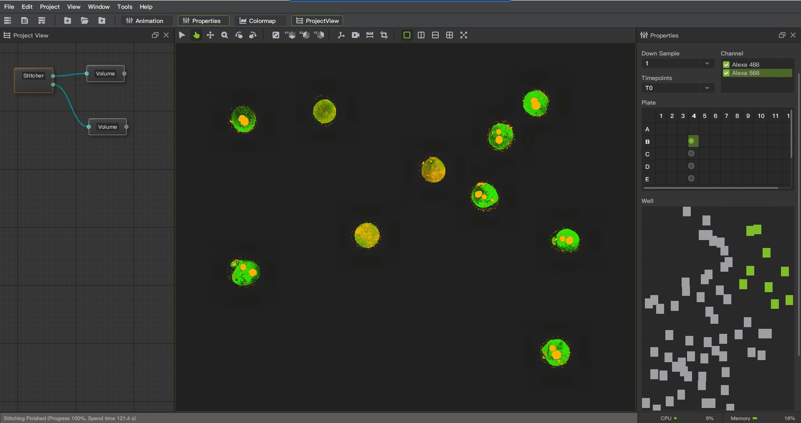

# Features

## Supported file formats

### Input file format

| Name | Introduction | Suffix | Support |
| ---- | ---- | ---- | ---- |
| PNG | PNG (Portable Network Graphics) is a lossless bitmap image file format | .png |[✓] |
| JPG | JPG (Joint Photographic Experts Group) is a common lossy compressed bitmap image file format | .jpg,.jpeg|[✓] |
| BMP | BMP (Bitmap) is a lossless bitmap image file format. It was originally developed by Microsoft to store and display images in the Windows operating system. |.bmp |[✓] |
| TIFF | TIFF (Tagged Image File Format) is a lossless bitmap image file format widely used to store and exchange high-quality image data. |.tiff,.tif |[✓] |
| DICOM | DICOM (Digital Imaging and Communications in Medicine) is a file format and communication protocol commonly used in the field of medical imaging. |.dcm,.dicom|[✓]|
| VTK Image Data | is a common file format for storing 3D image data | .vti |[✓] |

### Import image files
* Under the file menu, click to open data.
* In the project view, right-click on the blank area menu and click to open data.
* Drag and drop files to the project view area.

### Output file format

| Name | Introduction | Suffix | Support |
| ---- | ---- | ---- | ---- |
| PNG | PNG (Portable Network Graphics) is a lossless bitmap image file format | .png |[✓] |
| JPG | JPG (Joint Photographic Experts Group) is a common lossy compressed bitmap image file format | .jpg,.jpeg|[✓] |
| BMP | BMP (Bitmap) is a lossless bitmap image file format. It was originally developed by Microsoft to store and display images in the Windows operating system. |.bmp |[✓] |
| TIFF | TIFF (Tagged Image File Format) is a lossless bitmap image file format widely used to store and exchange high-quality image data. |.tiff,.tif |[✓] |
| DICOM | DICOM (Digital Imaging and Communications in Medicine) is a file format and communication protocol commonly used in the field of medical imaging. |.dcm,.dicom|[✓]|
| VTK Image Data | is a common file format for storing 3D image data | .vti |[✓] |

### Export image files
* Select the data nodes that need to be exported. Under the file menu, click to data save.

## Display

### OrthoSlice

Introduction: Displays 2D slices of multiple orthogonal directions in a 3D dataset.

Operation steps:
1. Right click on the node to pop up a menu
2. Select OrthoSlice

Function Description:
* Slice direction: Region 1 in the figure, change the direction of the slice.
* Slice number: Region 2 in the figure, change the position of the slice.
* Color map: Region 3 in the figure. Left slider, increase background to the left and decrease background to the right.Right slider, increase brightness to the left and decrease brightness to the right. Dropdown menu allows you to choose colors with different styles.
* Frame: Region 4 in the figure. Show and hide borders, adjust color and width.
* Properties: Region 5 in the figure. Adjustable interpolation method, opacity, ambient light, scattered light.
* Transform: Region 6 in the figure. Perform spatial transformations on objects, such as translation, scaling, and rotation.

### Slice

Introduction: Arbitrary angle slice display, slice display in 3D data at the angle and direction specified by the user, not limited to the orthogonal direction.

Operation steps:
1. Right click on the node to pop up a menu
2. Select Slice

Function Description:
* Slice direction: Region 1 in the figure, change the direction of the slice.
* Slice number: Region 2 in the figure, change the position of the slice.
* Thickness: Region 3 in the figure. Thickness adjustment function, adjust the thickness of slices to control the range of data contained in each slice.
* Color map: Region 4 in the figure. Left slider, increase background to the left and decrease background to the right.Right slider, increase brightness to the left and decrease brightness to the right. Dropdown menu allows you to choose colors with different styles.
* Plane: Region 5 in the figure. The origin and normal position of the axis.
* Transform: Region 6 in the figure. Perform spatial transformations on objects, such as translation, scaling, and rotation

### Volume

Introduction: Through volume rendering rendering technology, the three-dimensional data is converted into a visualized three-dimensional image to display the internal structure and surface shape.

Operation steps:
1. Right click on the node to pop up a menu
2. Select Volume

Function Description:
* Blend mode: Region 1 in the figure. Choosing different blending modes will result in different rendering effects. Composite blending mode is a method of blending foreground and background images, which determines the final color presentation based on the alpha value (transparency) of each pixel.Maximum intensity mode is a hybrid method that takes the maximum value of each channel in the foreground and background pixel values. Minimum intensity mode is a hybrid method that takes the minimum value of each channel in the foreground and background pixel values. Average intensity mode is a hybrid method that averages the color values of foreground and background pixels.Additive intensity mode is a mixing method that adds foreground and background pixel values. Isosurface extraction drawing is a method of connecting voxels with the same numerical values in a three-dimensional dataset to display these surface structures.
* Color map: Region 2 in the figure.Left slider, increase background to the left and decrease background to the right.Right slider, increase brightness to the left and decrease brightness to the right. Dropdown menu allows you to choose colors with different styles.
* Down sample: Region 3 in the figure. Downsampling according to proportion reduces clarity while improving rendering speed.
* Properties: Region 4 in the figure. Adjustable interpolation method, ambient, diffuse, specular, specular power.
* Transform: Region 5 in the figure. Perform spatial transformations on objects, such as translation, scaling, and rotation

### SliceViews

Introduction: Display slices in three directions with different windows.

Operation steps:
1. Right click on the node to pop up a menu
2. Select OrthoViews

Function Description:
* Slice number: Region 1 in the figure, change the position of the slice. 
* Color map: Region 2 in the figure.Left slider, increase background to the left and decrease background to the right.Right slider, increase brightness to the left and decrease brightness to the right. Dropdown menu allows you to choose colors with different styles.
* Transform: Region 3 in the figure. Perform spatial transformations on objects, such as translation, scaling, and rotation

### Isosurface

Introduction: The isosurface extraction visualization function is a common function in image software, which is used to extract the surface corresponding to a specific value or attribute in a 3D data set and visualize it.

Operation steps:
1. Right click on the node to pop up a menu
2. Select Isosurface

Function Description:
* Threshold: Region 1 in the figure, enter the threshold for contour extraction.
* Color map: Region 2 in the figure.Left slider, increase background to the left and decrease background to the right.Right slider, increase brightness to the left and decrease brightness to the right. Dropdown menu allows you to choose colors with different styles.
* Down sample: Region 3 in the figure. Downsampling according to proportion reduces clarity while improving rendering speed.
* Transform: Region 4 in the figure. Perform spatial transformations on objects, such as translation, scaling, and rotation

### Colormap

Introduction: Colormap is a technique for mapping data values to colors, often used in visualization. It represents the change and distribution of data by assigning different colors to different values.

Here are some features and uses of the Colormap function:

* Data presentation: Colormap can map the range of values to a continuous color band with various colors. This enables users to visually see the changing trend and distribution of the data, so as to better understand the data.

* Emphasize differences: Colormap can highlight differences and patterns in data. By using high-contrast color maps or special maps designed for specific data types, users can more accurately distinguish subtle changes in data.

* Optionality and flexibility: Colormap provides a variety of predefined color mappings, such as rainbow, temperature, grayscale, etc., to meet different needs. In addition, users can also customize the color mapping to personalize the design according to the characteristics and goals of the data.

* Association with data: Colormap usually establishes a clear association with data values. Among them, low values can be represented by cool colors (such as blue), high values can be represented by warm colors (such as red), and intermediate values can be represented by neutral colors (such as gray).

* Color Interpretation: With Colormap, users can convert data values into easy-to-understand color codes. In this way, whether it is a chart or an image, it can more intuitively convey the meaning of the data and help users make correct inferences and decisions.

Function Description:
* Scalar range: Region 1 in the figure. Control the numerical range of color mapping.
* Color map: Region 2 in the figure. Preset color mapping style.
* Histogram: Region 3 in the figure. Displaying or hiding histogram.
* Opacity: Region 4 in the figure. Opacity adjustment area. Adjust opacity by dividing into different areas through multiple points.
* Color: Region 5 in the figure. Color adjustment area. Adjust the color by dividing it into different areas through multiple points.

## Annotate

### MeasuringDistance

Measure the linear distance between two points.

### GridAxis

Provides a convenient and accurate way to represent the location and value range of a data point.

* Grid line generation: GridAxis can generate horizontal and vertical grid lines to divide the chart area into uniform small squares. These gridlines help users locate data points on the chart and provide reference lines to gauge the size and distribution of data.

* Coordinate axis drawing: GridAxis can also draw coordinate axes and mark the numerical range of data. It automatically calculates ticks and labels based on the minimum and maximum values of the data and displays them at the appropriate positions. This enables users to gain a clearer understanding of the scale and variability of the data.

* Customization options: GridAxis usually provides various customization options, such as scale interval, scale line style, label format, etc. This allows users to adjust the way the axes are displayed according to their needs and preferences, and to meet the requirements of specific data visualizations.

### Scalebars

Scalebars are used to display lengths and scales in the real world. It provides a convenient way to measure and represent distances on images or maps, and helps users understand the dimensions and relative sizes of images.

* Length measurement: Scalebars allows the user to select two points on an image or map and calculate and display a scale based on the distance between the two points. This allows users to accurately measure distances in the real world and map them onto images or maps.

* Unit conversion: Scalebars usually provide unit conversion options, such as expressing the scale bar in millimeters, centimeters, inches or other units required by the user. In this way, users can choose the appropriate distance unit according to their own needs, and convert between units.

* Marking and Annotation: The Scalebars feature also typically allows the user to mark and annotate relevant information on the scale bar. This way, users can add text, arrows, or other symbols to explain the meaning of the scale and provide a richer description.

### BoundingBox
BoundingBox is used to draw a box on the image, showing the boundary and appearance range of the object. It provides a simple and intuitive way to label the position, size and boundary information of objects.

## Algorithm

### Crop

The cropping function is a common method of region extraction, which is used to intercept or delete unnecessary parts to obtain the desired perspective or content. It provides an easy and effective way to adjust and change the composition of the image and helps the user to focus on areas of interest.

### Resample

The resampling function can increase or decrease the resolution of an image. Resize images by recalculating pixel values and interpolating to meet specific requirements or application needs.

* For lower resolution images, the details of the image are reduced by pixel binning or downsampling.

* For higher resolution images, extra pixels are added through an interpolation method to improve image detail.

### Stitcher

Stitcher is made for precise alignment and fusing of multiple microscopy image tiles into one 2D, 3D or 4D volume.

Stitching tiles into one large image requires large image handling as well as alignment precision for a high quality result. 

Stitcher's algorithm addresses the imperfections in microscope stage positioning including camera rotation relative to the stage to provide the best alignment results across the entire fused image.

####  Position Correction

* Alignment and stitching of 2D,3D or 4D overlapping image blocks.

* Possible alignment and stitching of multiple tiles with many channels.

#### Image Stitching

* Supports input and output  images up to Terabytes in size.

* Pseudo color mapping function enhances image visualization effect.

* Provide rich image fusion methods and eliminate stitching marks, making image visualization clearer and more natural.

#### Lens Shadow Correction

* Remove and repair image shadows generated by light sources, lenses, or other factors, enhance image details, colors, and contrast.

#### Low signal-to-noise ratio image noise suppression

* By applying multi-scale processing technology, images are decomposed and denoised in different frequency ranges, thereby better suppressing noise in low signal-to-noise ratio images.

#### Operation steps
1. Right click on the blank area to bring up a menu
2. Click to create a new object and a pop-up menu will appear
3. Select Stitcher

#### Function Description
* Directory: Region 1 in the figure. Select the data directory exported by Harmony.
* Channel: Region 2 in the figure. Select the channels that need to be spliced.
* Down sample: Region 3 in the figure. Downsampling according to proportion reduces clarity while improving rendering speed.
* Time Point: Region 4 in the figure. Selecting data at different time points
* Plate: Region 5 in the figure. All wells in a plate.
* Well: Region 6 in the figure. All fields in a well.
* Z stack: Region 7 in the figure. Select Z-stack range
* Expectation: Region 8 in the figure. Expected image resolution and memory usage.
* Apply: Region 9 in the figure. Button for executing.

## Platform Function

### Project

Saving and restoration of project engineering, users can save the state, configuration and operation records of the entire image processing project as a project file, and reopen the file to restore to the previous state when needed.

Node-based operations, representing data or tasks as independent nodes, and building complex data flows or processing processes by connecting these nodes. Each node represents a specific function or operation, and the connections between nodes define the data flow and processing sequence.

### Animation

* Fragment add, delete function.
* Preview, loop preview, stop preview function.
* Video generation function, providing setting frame rate and resolution.
#### CameraOrbit

Create a clip by setting the camera's rotation direction, angle and duration.

#### CameraPath

Create a segment by adding custom track points.

### Plugin System

A plug-in system is a mechanism for providing extensibility and customization of software applications. It allows users or third-party developers to write, install and run additional plug-in modules to enhance the functionality and features of the software.

Here are some common features and benefits of plugin systems:

* Extended functions: The plug-in system allows users to extend the functions and features of the software by installing and enabling different plug-ins. These plug-ins can provide new tools, functions, effects, filters, interfaces, etc., so that the software can meet the needs of more users.

* Customization: The plug-in system enables users to customize the software according to their needs and preferences. Users can choose to install and use only the plug-ins they are interested in, thus avoiding unnecessary functional redundancy and improving work efficiency.

* Third-party development: The plug-in system encourages and supports third-party developers to create and publish plug-ins. In this way, the ecosystem of the software becomes richer and more diverse, users can choose from more plug-ins, and obtain innovative and unique functions.

* Flexibility and easy update: The plug-in system makes the software function modular, and the plug-ins are relatively independent. In this way, when the software is updated, only specific plug-ins can be updated without affecting the operation of the entire software. This provides flexibility and simplifies the update process.

* Community Engagement: The plugin system encourages communication, sharing and collaboration between users and developers. Users can find and discuss plugins, get support and advice in the plugin community. At the same time, developers can share their plug-ins and receive feedback and suggestions from users, so as to continuously improve and perfect them.

### SnapShot

Take a screenshot of the specified window, save the file in the specified path and format, and support setting DPI.

### Record

Record the screen of the selected window and output the avi format file.

### Fullscreen

Display the selected window and selected screen in full screen.

Press Esc to exit

### CameraLink

A function of synchronously controlling the viewing angle control of one or more view windows.

### View Control

In the toolbar, you can set different viewing angles.

### Direction Axis

In the toolbar, provide a navigation gizmo that shows the XYZ direction.

### View Layout

Set it in the toolbar or menu

* Single view
* Two vertical views
* Two horizontal views
* Four views

### Language Switch

Supports switching between two languages, which will take effect after restarting the program.

* Chinese
* English

### Background Setting

* Single color background
* Gradient color background

### User Manual

Menu Help, User Manual

### Upgrade

### About

Application release notes, build information, and third-party open source library license notices

