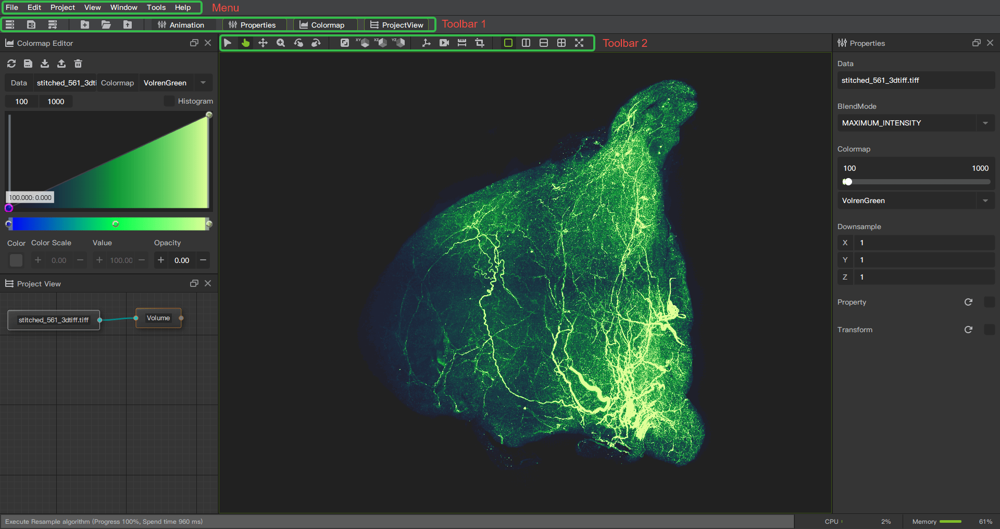
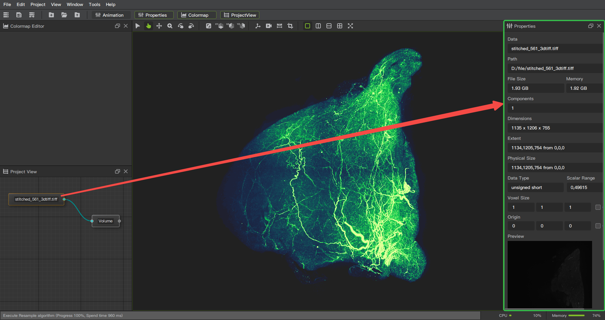
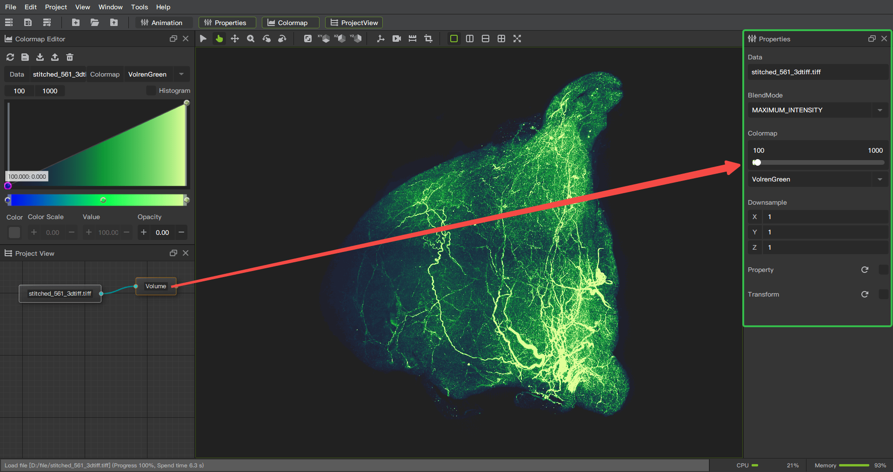
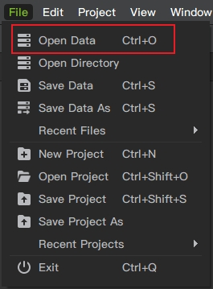
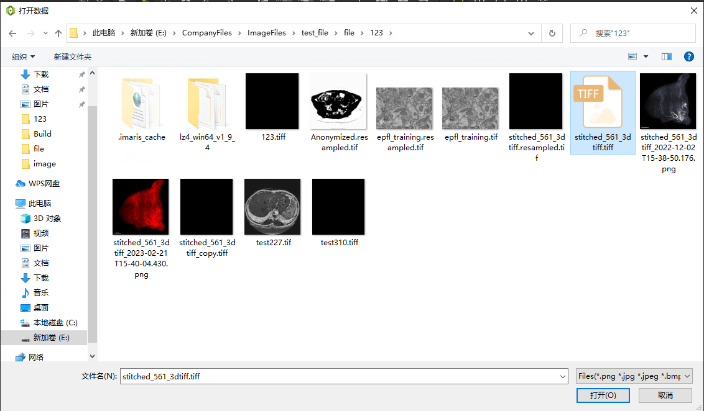
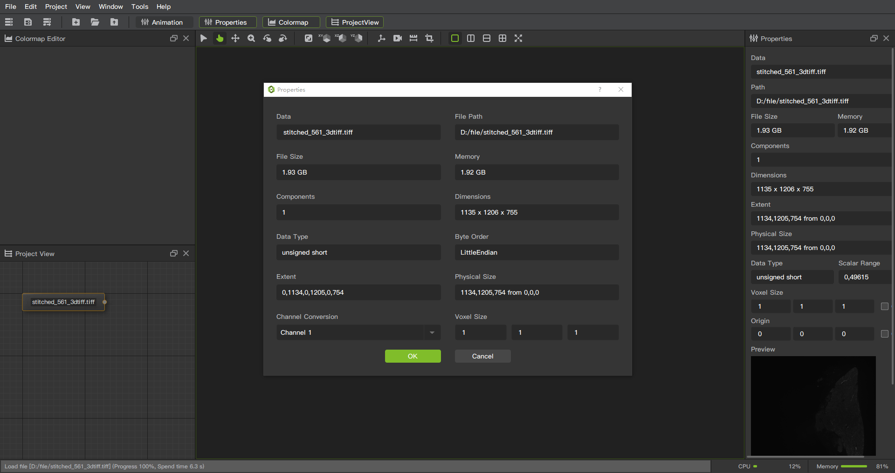
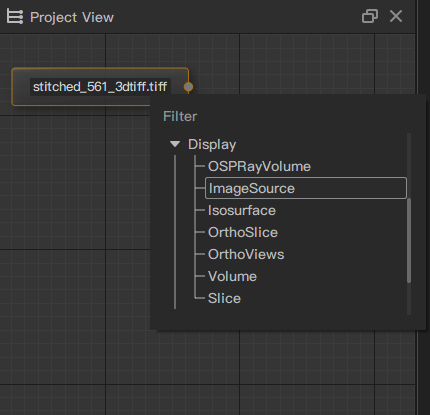
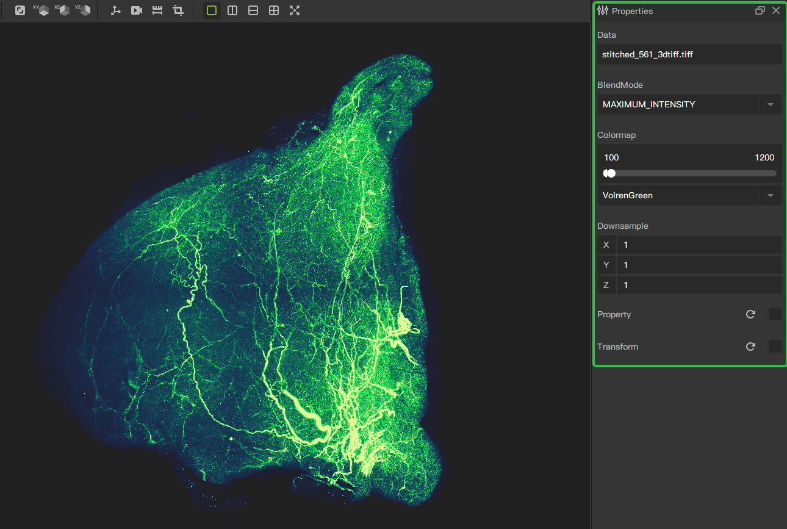
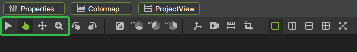

# User Interface

## Start interface

Loading modules/plugins during startup

## Application overview

BI-Viewer represents all data sets, algorithms (including visualization algorithms, processing algorithms and analysis algorithms) as "nodes".

BI-Viewer provides a large number of modules/plugins, and each module/plugin provides a specific set of functions for creation and operation in the interface.

Unlike modules/plugins that directly interact with each other, BI-Viewer contains more than 40 built-in modules/plugins, and other modules/plugins can be installed using plugin management.

## Module Panel

The **Properties** window (located by default on the right side of the application's main window) displays all the options and functions available to the user for the current module. The current module/node can be selected in the **Project View**.

## Load data

Under the **File** menu in the menu bar, select **Open Data**.

Select the image file to open.

After loading successfully, the file properties window will pop up.

## Interacting with views

BI-Viewer provides a variety of display modules, attribute adjustment functions, mouse, shortcut keys and other interactive methods.

### Selecting displayed data
Select the data node, right-click to pop up the menu, select a **Display** module in the **Display** category, wait for the rendering to complete, and you can see the display result in the view window.

### Adjusting image properties

By selecting the display module, you can see the property window on the right. Through the adjustment of the property window, you can complete the presentation of different display effects.

## Mouse & Keyboard Shortcuts
### Mouse

Provides the choice of 4 mouse interaction modes, which are selection mode, gesture mode, move mode, and zoom mode.

* Selection mode: fixed viewing angle, mouse operation will not change the viewing angle.
* Gesture mode: the left mouse button controls the viewing angle to move according to the mouse track, and adjusts the viewing angle.
* Move mode, the left mouse button controls the viewing angle to pan.
* Zoom mode: the left mouse button controls the viewing angle to zoom in, zoom in up and zoom out down.

## Generic shortcuts

|  Shortcut   | Operation  |
|  ----  | ----  |
| r  | reset zoom and pan to default |
| i  | space transformation box |