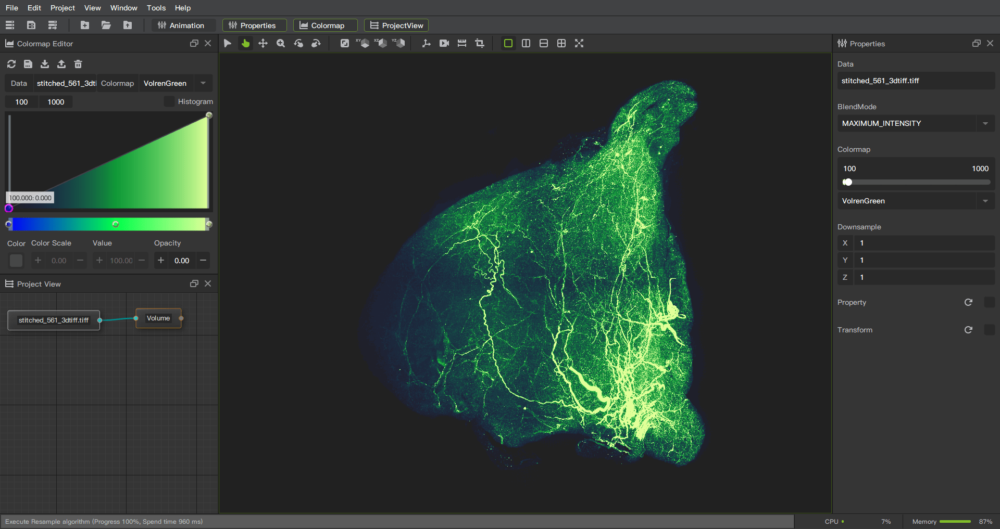

# Introduction

## What is Biological Imaging Viewer

The abbreviation of Biological Imaging Viewer is BI-Viewer.

* A software application for visualization and analysis of large-volume biological/medical image data sets. All commonly used data sets are supported, such as images, segmentations, surfaces, annotations, transformations, etc., in 2D, 3D, and 4D. Visualization is available on desktop and in virtual reality.
 
 
* A highly modular software platform, all functions and interfaces are modularized to form different plugins, and users can choose the plugins they need. All features are available and extensible in Python and C++. A full Python environment is provided where any Python packages can be installed and combined with built-in features.
 
 
* An open software platform that provides an interface for plug-in development, allowing developers to develop plug-ins. Developers can focus on developing new methods and do not need to spend time with redeveloping basic data import/export, visualization, interaction features.
 
 

## Main interface

## Main functions

Provides simple to complex visualization, processing & analysis functions.
### Visualization

* Orthogonal slice
* Any angle slice
* 3D volume rendering
* Color mapping
* GB level large-capacity image visualization
* Measurement and labeling
### Image Processing
* Cropping
* Resample
* Threshold segmentation
### Platform function

* Animation
* Python support
* Plugin system
* Workflow of node operation
* Project preservation and restoration

## Supported image formats

* PNG
* JPG, JPEG
* TIFF
* DICOM
* BMP
* VTI

## Customized functions

* Microscopic image registration algorithm
* MRA cerebrovascular analysis and diagnosis

## License

BI-Viewer is a commercial software system that can provide a free trial.