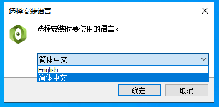
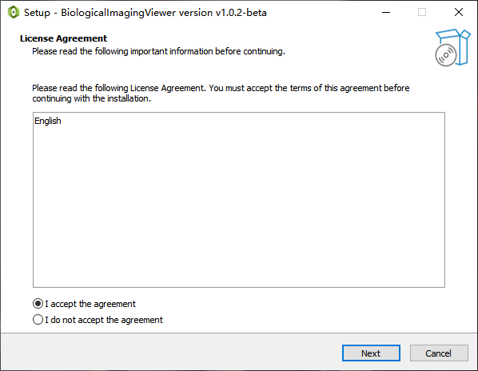
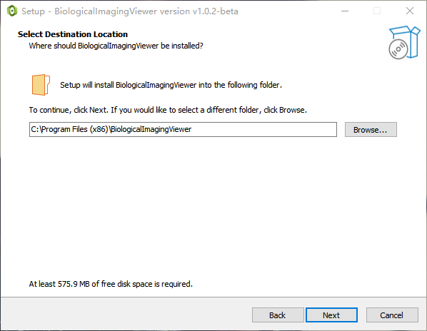
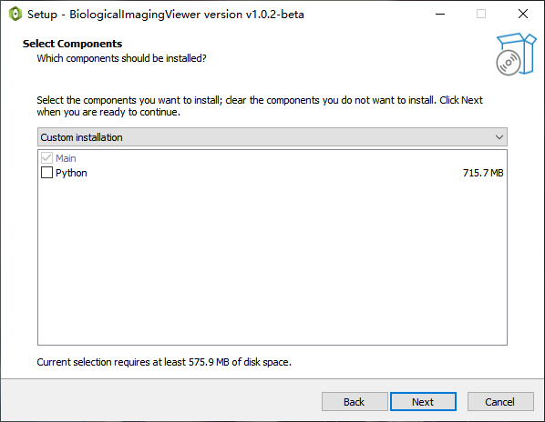
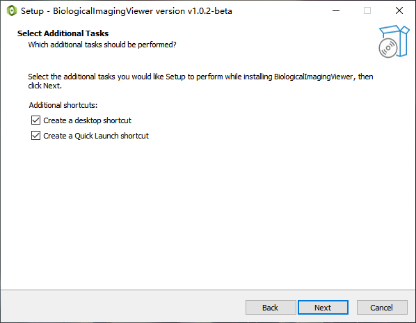
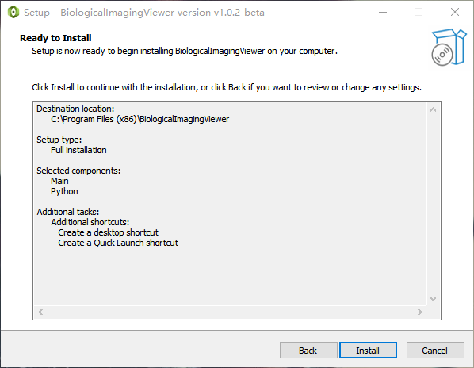
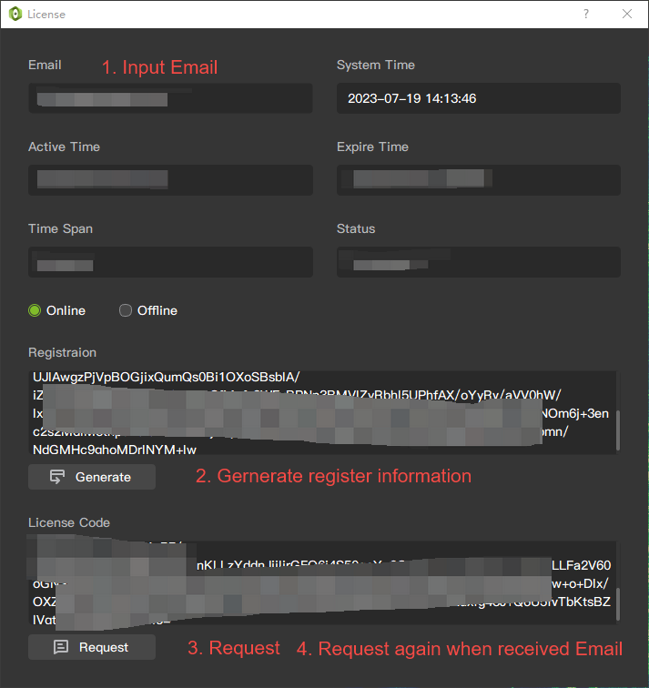
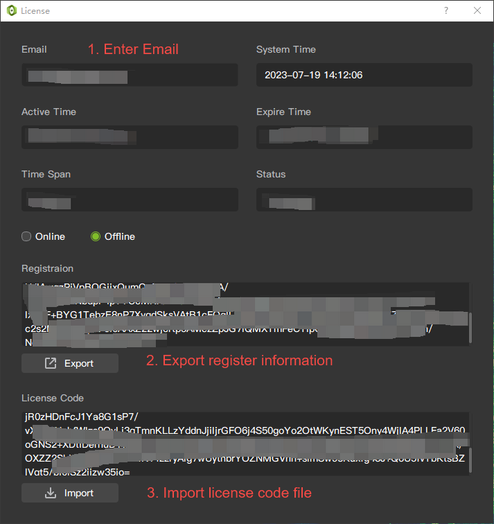

# Installation & Activation

## Download

Download the latest exe installation package from the official website([www.chipcloudtech.com](http://www.chipcloudtech.com)).
## Install

1. Click the exe installation package and select the language of the installation package.

2. Click to agree to the license agreement statement.

3. Choose the installation path.

4. Component selection, optional installation of Python modules, if no Python module is selected, the functions of Python-related modules will not be available, and the normal operation of the system will not be affected. It is recommended not to install it, it will take up much less space and the installation speed will be faster.

5. Shortcut selection.

6. Click Install and wait for the installation to complete.

## License activation steps

There are two ways to activate a license:
* Online activation needs to be performed in an environment with a network.
* Offline activation can be performed in a non-network environment.
### Online activation
1. Fill in the email address to receive the activation code later.
2. Click the **Generate** button to generate registration information.
3. Click the **Request** button, contact the customer service manager, and issue the activation code.
4. After receiving the email, click the **Request** button again to complete the activation.

### Offline activation
1. Fill in the email address to receive the activation code later.
2. Click the **Generate** button to generate registration information.
3. Click the **Export** button to export the registration information to a file.
4. Send the file to the customer service manager.
5. After receiving the email, **Import** the activation code information into the activation code to complete the activation.

