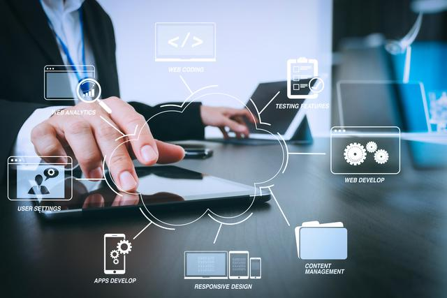

# Technical Support

## Efficient service
### Efficient response

7*24 hours standby, domestic response within 10 minutes, and solutions within 1 hour
### Tailored

From pre-sales support to site acceptance, the whole process is strictly and standardizedly controlled by the professional project management team of the original factory.

Provide customized solutions to overcome site limitations and maximize customer needs.

One-on-one application training service by exclusive training experts.
## Panoramic training
Meet diverse training needs in an all-round way
### Field application training
Implement standardized, standardized, and personalized training services for operators, fully develop equipment performance, and enable operators to complete clinical examinations quickly and independently to meet clinical needs.
### Online Training
The lecturer team is composed of senior training experts and core R&D personnel, and regular training courses are held to explain the technical principles, sequence foundation, clinical application and latest technological progress for clinicians and technicians, and systematically improve the professional technical level of clinicians and technicians.
## Contact us

**Wuhan Chipcloud Data Technology Co.,Ltd**

Address : 7th Floor, Building B4, Wuhan Future Science and Technology City, No. 999 Gaoxin Avenue, East Lake New Technology Development Zone, Wuhan City

E-mail : service@chipcloudtech.com

Tel : 027-86635918

Official website address : [www.chipcloudtech.com](http://www.chipcloudtech.com)
